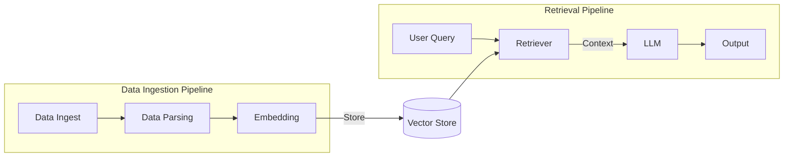

# Notes

## Shortcomings of LLMs (addressed by RAG)

- Fixed context window — limits the amount of information they can process at once
- No access to up-to-date information — trained on a static dataset
- Lack of domain-specific knowledge not well-represented in training data
- Hallucinations — may generate plausible-sounding but incorrect information
- No source citations — cannot point to where information came from
- Limited complex reasoning that requires access to external knowledge or data
- No personalisation based on user-specific data or preferences

---

## RAG Pipeline Diagram

---

## RAG Pipeline: Key Concepts

There are 2 main pipelines in a RAG system:

### 1. Data Ingestion Pipeline
Load, chunk, embed, and store documents into a vector database.

- **Parsing** — Reads unstructured data and breaks it into smaller chunks. Chunking is necessary because embedding models have a maximum token limit, and smaller chunks also help preserve the context of the original data for search and retrieval.

- **Embedding** — Converts parsed text chunks into numerical vectors using a pre-trained language model. These vectors are stored in a vector database, enabling efficient similarity-based search and retrieval.

### 2. Query Retrieval Pipeline
Embed the user's query, search the vector database, and return relevant chunks to the LLM to generate a response.

- **Query** — A request or question posed by the user. For example, typing *"best restaurants near me"* into a search engine is a query.

- **Retrieval** — The act of locating and returning the most relevant documents or chunks that match the query from the vector store.
