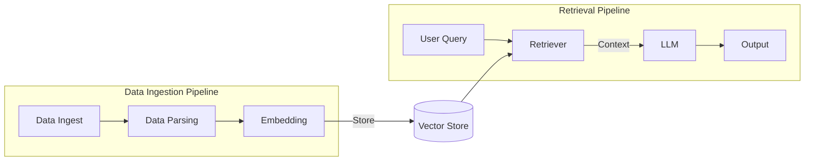

# Notes

## Shortcomings of LLMs (addressed by RAG)

- Fixed context window — limits the amount of information they can process at once
- No access to up-to-date information — trained on a static dataset
- Lack of domain-specific knowledge not well-represented in training data
- Hallucinations — may generate plausible-sounding but incorrect information
- No source citations — cannot point to where information came from
- Limited complex reasoning that requires access to external knowledge or data
- No personalisation based on user-specific data or preferences

---

## RAG Pipeline Diagram

---

## RAG Pipeline: Key Concepts

LangChain:
LangChain is a framework that provides ready-made building blocks for building LLM-powered applications. Instead of writing all the glue code yourself (connecting data loaders → chunkers → embedders → vector stores → LLMs), LangChain gives you pre-built components for each step that work together out of the box.

Think of it as the orchestration layer of your RAG pipeline. For your RAG pipeline, LangChain essentially replaces all the custom glue code between each stage.

There are 2 main pipelines in a RAG system:

### 1. Data Ingestion Pipeline
Load, chunk, embed, and store documents into a vector database.

- **Steps in Data Ingestion Pipeline**
  - Load Data and Data Parsing
  - Create the "document structure" (specific to Langchain)
  - Chunking
  - Embedding
  - Store in the vector database

- **Parsing** — Reads unstructured data and performs operations like extracting clean text, removing noise (headers, footers, ads, page numbers), and identifying sections or paragraphs.

- **Document Structure** - It is a kind of a data structure that represents the original document in a way that preserves its context and relationships between different parts. For example, if you have a PDF with multiple sections, the document structure would capture the hierarchy of sections, subsections, and paragraphs.
  - Core Components of Document Structure:
    - **Metadata (dictionary)** — Information about the document (e.g., file name, No of pages, timestamp,title, author, date) that can be used for filtering and retrieval.
    - **Page Content (string)** — The actual text or data from the document that will be embedded and searched.
  - There are multiple Document Loaders available in LangChain for different file types (PDFs, Word docs, HTML, etc.) that takes the respective file as an input and outputs a Document Structure.
 
- **Embedding** — Converts parsed text chunks into numerical vectors using a pre-trained language model. These vectors are stored in a vector database, enabling efficient similarity-based search and retrieval.

### 2. Query Retrieval Pipeline
Embed the user's query, search the vector database, and return relevant chunks to the LLM to generate a response.

- **Query** — A request or question posed by the user. For example, typing *"best restaurants near me"* into a search engine is a query.

- **Retrieval** — The act of locating and returning the most relevant documents or chunks that match the query from the vector store.
