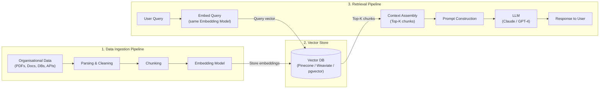
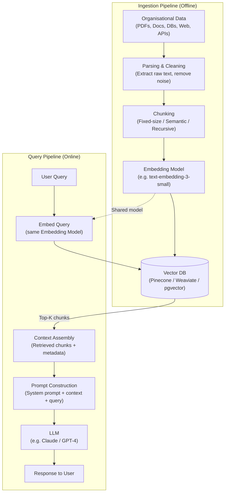

# Notes

Shortcomings of LLMs as compared to RAG:

- LLMs have a fixed context window, which limits the amount of information they can process
- LLMs may not have access to up-to-date information, as they are trained on a static dataset
- LLMs may struggle with domain-specific knowledge that is not well-represented in their training data
- LLMs may generate plausible-sounding but incorrect information (hallucinations)
- LLMs may not be able to provide sources or citations for the information they generate
- LLMs may not be able to handle complex reasoning tasks that require access to external knowledge or data
- LLMs may not be able to provide personalized responses based on user-specific data or preferences

## RAG Pipeline Diagram

---

## RAG Pipeline Diagram: Retrieval Pipeline - Passive Lookup (Traditional RAG)

Steps:
Data Ingestion pipeline: Data (Unstructured) -> Parsing -> Embedding -> Vector Store/ Vector DB

Parsing: Step which defines how to read the unstructured data and chunk it into smaller pieces. This is important because the embedding model has a maximum token limit, and we need to ensure that the chunks of text we create do not exceed this limit. The parsing step also helps to preserve the context of the original data, which can be important for downstream tasks such as search and retrieval

Embedding: Step which defines how to convert the parsed chunks of text into a numerical representation (vector) that can be stored in a vector database. This step typically involves using a pre-trained language model to generate embeddings for each chunk of text. The resulting vectors can then be stored in a vector database, which allows for efficient search and retrieval based on the similarity of the vectors.

